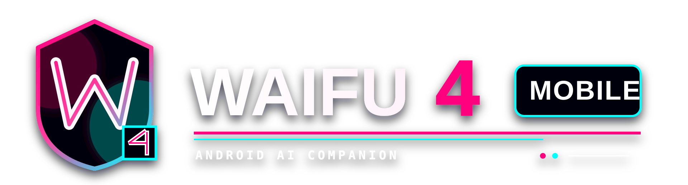

<div align="center">



### _The Waifu4 realtime AI companion, rebuilt for Android without a Termux runtime or companion server._

Waifu4 Mobile combines streamed LLM chat, realtime Fish Audio speech, a full-screen
VRM avatar, emotion-driven animation, lip sync, Android speech recognition, and
bounded local memory in a touch-first app.

<br/>


<br/>

<a href="#what-this-is">What This Is</a>
·
<a href="#feature-map">Feature Map</a>
·
<a href="#ai-runtime">AI Runtime</a>
·
<a href="#realtime-voice">Voice</a>
·
<a href="#avatar-and-animation">Avatar</a>
·
<a href="#mobile-memory">Memory</a>
·
<a href="#quick-start">Quick Start</a>
·
<a href="#release-status">Status</a>

</div>

---

<h2 align="center" id="what-this-is">What This Is</h2>

<p align="center">
  <strong>A mobile AI companion with a Waifu4 VRM body, streamed voice, native
  Android controls, and no desktop process hiding underneath.</strong>
</p>

<p align="center">
  The UI, state, provider clients, audio pipeline, speech input, memory, file
  storage, and key security are Kotlin/Android. The VRM viewport packages Waifu4's
  proven Three.js renderer locally so MToon materials, spring bones, animation
  retargeting, and expressions survive the move to mobile.
</p>

The app does **not** launch Termux, Node.js, Electron, localhost, or an external
backend. Provider traffic goes directly from the Android process to the service the
user selects.

The mobile settings flow is split into four touch-friendly surfaces:

`Avatar` · `Character` · `AI` · `Voice`

Provider keys are bring-your-own and stored with Android Keystore-backed
encryption. There is no Waifu4 account and no required Waifu4 cloud service.

---

<h2 align="center" id="feature-map">Feature Map</h2>

| Surface | Implemented mobile feature set |
| --- | --- |
| **Home** | Full-screen VRM stage, expandable chat history, keyboard input, central talk button, stop control, and hideable bottom call dock. |
| **Character** | Neuro-sama, Riko, and Hikari personas; per-persona system prompt, recent conversation, pinned profile notes, and bounded memory highlights. |
| **AI** | OpenRouter and Vercel AI Gateway, live model catalogs, capability-aware reply lanes, provider routing, streamed visible deltas, reasoning controls, runtime situation, reply length, temperature, and output limit. |
| **Voice** | Fish realtime WebSocket TTS, S2.1/S2/S1 selection, voice catalogs, manual reference ID, latency/sample/chunk controls, early phrase streaming, native PCM playback, and wLipSync controls. |
| **Speech input** | Android speech-recognizer picker with automatic on-device preference where the installed phone service supports it. |
| **Avatar** | Seven bundled VRMs, user VRM import/delete/select, half/full-body framing, position/scale/rotation, gaze, blink, arm guard, MToon tuning, outlines, color correction, exposure, and lighting. |
| **Animation** | Waifu4 FBX base clips, 42 Sachi VRMA clips, Silly BVH and SillyTavern BVH catalogs, safe shuffled autoplay, manual playback, loop, speed, duration, reactions, and crossfades. |
| **Lip sync** | Native audio analysis into A/I/U/E/O weights, hybrid/direct modes, smoothing, gain, volume influence, and Web Audio-clock-independent Android playback state. |
| **Storage** | Keystore-backed provider secrets, app-private custom VRMs, settings, chat, memory, and relevant Waifu4 local-transfer backup import. |

---

<h2 align="center" id="architecture">Native Android, Faithful VRM</h2>

Waifu4 Mobile is deliberately hybrid at one narrow boundary. Keeping that boundary
small gives the app native mobile behavior without throwing away the renderer that
made the original avatar look right.

| Layer | Implementation | Network/server requirement |
| --- | --- | --- |
| App shell and menus | Kotlin + Jetpack Compose | None |
| LLM and model catalogs | Native OkHttp clients | Selected external provider |
| TTS and voice catalog | Native OkHttp WebSocket/HTTP | Fish Audio |
| Audio and lip sync | `AudioTrack` + native analyzer | None after audio arrives |
| Memory and settings | App-private Android storage | None |
| Provider secrets | Android Keystore-backed AES/GCM | None |
| VRM viewport | Packaged local WebView + compiled Waifu4 renderer | None |

```text
┌──────────────────────── Jetpack Compose UI ────────────────────────┐
│ chat · settings · model/voice pickers · Android speech input      │
└──────────────────────────────┬─────────────────────────────────────┘
                               │ state and typed commands
┌──────────────────────────────▼─────────────────────────────────────┐
│ WaifuViewModel · native LLM · Fish · AudioTrack · memory · keys   │
└──────────────────────────────┬─────────────────────────────────────┘
                               │ local bridge only
┌──────────────────────────────▼─────────────────────────────────────┐
│ packaged Waifu4 Three.js / @pixiv/three-vrm avatar renderer       │
└────────────────────────────────────────────────────────────────────┘
```

The local renderer is served through `WebViewAssetLoader`. File and content access
are disabled, off-host requests are blocked, and the renderer has no remote page or
localhost dependency.

---

<h2 align="center" id="ai-runtime">AI Runtime</h2>

### Provider and model compatibility

The Android port preserves separate request paths for OpenRouter and Vercel instead
of pretending every OpenAI-compatible endpoint behaves identically.

- **OpenRouter:** Auto, fastest-latency, highest-throughput, or pinned-provider
  routing with optional provider fallback.
- **Vercel AI Gateway:** Auto, fastest first token, highest throughput, lowest cost,
  or pinned-provider routing with optional fallback.
- **Live catalogs:** model IDs, context windows, output limits, supported parameters,
  modalities, structured-output support, caching, and reasoning metadata are loaded
  into the native picker.
- **Reasoning compatibility:** provider/model shaping avoids hidden reasoning
  consuming the visible answer and handles DeepSeek/Vercel compatibility separately
  from OpenRouter.
- **Structured reply gating:** structured metadata is requested only where model and
  endpoint capability data support it; the streamed text metadata lane remains the
  compatibility fallback.

### Streaming conversation pipeline

- Visible text is emitted incrementally instead of waiting for the completed reply.
- The local conversation window keeps the latest 36 normalized turns.
- Persona, runtime situation, reply length, memory context, TTS constraints, and
  emotion metadata instructions are composed into the native request.
- `<yw-meta>` or structured metadata is filtered from visible/spoken dialogue and
  used to drive emotion and expression state.
- Generation and Fish connection work overlap so speech can begin from an early
  safe phrase rather than after the full answer.

---

<h2 align="center" id="realtime-voice">Realtime Voice</h2>

Speech latency is treated as part of the conversation, not an afterthought. One Fish
realtime socket receives speakable LLM deltas while the reply is still streaming.

### Fish Audio

| Control | Mobile behavior |
| --- | --- |
| **Models** | `s2.1-pro`, `s2.1-pro-free`, `s2-pro`, and `s1` |
| **Voices** | My models, public models, combined catalog, or manual reference ID |
| **Latency** | Balanced/fastest or normal quality |
| **PCM rate** | 16, 22.05, 24, 32, 44.1, or 48 kHz |
| **Chunking** | Fast phrase, safe phrase, or eager raw deltas |
| **Continuity** | Optional previous-chunk conditioning and adjustable chunk length |

Fish events use the same MessagePack `start`, `text`, `flush`, and `stop` contract as
Waifu4 and Fish's realtime SDK. PCM plays through Android `AudioTrack`; there is no
Termux Fish installation and no WebSocket bridge server.

### Mouth motion

- Native audio analysis produces amplitude, frequency bands, and A/I/U/E/O mouth
  weights from the audio that is actually playing.
- **wLipSync Hybrid** blends visemes with volume energy; **Direct** uses the viseme
  output more literally.
- Smoothing, mouth gain, and volume influence remain adjustable.
- The first decoded audio primes lip sync before playback to reduce the silent mouth
  at the start of a response.

### Speech-to-text

The talk button uses Android's installed speech-recognition services. Users can
choose a specific recognizer or let the app prefer the phone's on-device recognizer
when one is available. Availability and offline behavior therefore depend on the
recognition packages installed by the phone manufacturer or user.

---

<h2 align="center" id="avatar-and-animation">Avatar and Animation</h2>

### VRM stage

- Bundled characters: Riko Final Fixed, RIKOV343, RIKOV3, Peak Riko,
  Hikari/Cool Hikky, Neuro-sama, and Neuro Clown.
- Import additional `.vrm` files through Android's document picker, keep them in
  app-private storage, switch between them, or delete them from the library.
- Half-body/full-body framing plus model X/Y/Z position, scale, and XYZ rotation.
- Auto blink, procedural gaze, spring bones, expressions, and configurable arm/torso
  clipping guard.
- Original MToon material path with outline, shade/rim tuning, RGB correction,
  exposure, and key/fill/rim/hemisphere/ambient light controls.

### Animation player

The packaged catalog includes the same families used by the Waifu4 renderer:

| Format | Included behavior |
| --- | --- |
| **VRMA** | Complete 42-clip Sachi catalog with normalized humanoid retargeting |
| **BVH** | Silly safe subset plus the full SillyTavern catalog |
| **FBX** | Idle, Idle 2, Idle 3, and Thinking base clips |

Safe ambient clips use a shuffled non-repeating loop. Manual selection exposes the
larger gesture, emotion, pose, dance, and movement library without automatically
dropping the avatar into unsafe full-body poses. Animation speed, duration, loop,
and one-second crossfade behavior remain adjustable.

---

<h2 align="center" id="mobile-memory">Mobile Memory</h2>

The mobile memory design intentionally does not port Waifu4's GRILLO/Ladybug
background worker. Phones get useful continuity without a second hidden model call,
embedding runtime, graph database, or runaway storage lane.

- Conversation state is scoped per persona.
- Recent messages persist locally and are bounded before provider requests.
- Users can edit a pinned relationship/profile note.
- Salient local highlights are scored and capped.
- Injected memory has a 2,000-character ceiling.
- Chat and memory can be cleared independently from the Character settings page.

This keeps memory predictable on mobile and makes its token cost visible.

---

<h2 align="center" id="quick-start">Quick Start</h2>

### Requirements

- Android Studio with JDK 17, or JDK 17 plus Android SDK command-line tools.
- Android SDK platform 34 and current platform-tools.
- Android 8.0 or newer on the target phone (`minSdk 26`).
- An OpenRouter or Vercel AI Gateway key for chat.
- A Fish Audio key for realtime TTS.

### Build and install

```sh
git clone https://github.com/xsploit/Waifu4-Mobile.git
cd Waifu4-Mobile
./gradlew :app:testDebugUnitTest :app:assembleDebug
adb install -r app/build/outputs/apk/debug/app-debug.apk
```

The APK is written to `app/build/outputs/apk/debug/app-debug.apk`. No npm install or
frontend build is required: the local avatar renderer is already compiled into the
Android assets. The current debug APK is approximately 104 MiB.

### Release signing

```sh
export ANDROID_KEYSTORE_PATH=/absolute/path/to/upload-key.jks
export ANDROID_KEYSTORE_PASSWORD=...
export ANDROID_KEY_ALIAS=...
export ANDROID_KEY_PASSWORD=...
./gradlew :app:bundleRelease
```

The AAB is written beneath `app/build/outputs/bundle/release/`. Keystores and
passwords must stay outside the repository.

---

<h2 align="center" id="project-layout">Project Layout</h2>

```text
app/src/main/java/       Compose UI, state, providers, audio, memory, storage
app/src/main/assets/     VRMs, VRMA/BVH/FBX, lip-sync profile, local renderer
app/src/test/            Native JVM unit tests
docs/assets/             Repository artwork
gradle/                  Gradle wrapper
tools/                   Optional VRM texture optimization utility
```

The editable TypeScript source for the avatar renderer remains in the upstream
[Waifu4](https://github.com/xsploit/Waifu4) repository. Build its `mobile-avatar`
target there and replace the generated HTML/JavaScript/CSS under
`app/src/main/assets/avatar/` when intentionally updating that renderer. The desktop
application and its npm dependency tree do not belong in this repository.

---

<h2 align="center" id="release-status">Release Status</h2>

| Release lane | Status |
| --- | --- |
| **Sideloaded debug APK** | Working alpha; unit suite and clean debug build pass |
| **Android portability** | APK-owned runtime; no Termux, Shizuku, Node, or server required on other phones |
| **Package size** | Approximately 104 MiB debug APK after VRM/animation compression |
| **Google Play target** | API 36 migration required for submissions after August 31, 2026 |
| **Play disclosures** | Privacy policy, Data Safety form, and in-app generative-AI reporting still required |
| **Play signing** | Upload key, Play App Signing, release AAB, and final bundletool size check still required |
| **Asset release audit** | Redistribution rights for bundled models, animation, and textures must be confirmed |

This is an alpha build, not a finished Play Store release. Twitch, Discord voice,
Inworld, Piper, Tavily tools, desktop overlays, and the GRILLO memory worker belong
to upstream Waifu4 and are **not claimed as implemented here**.

---

<h2 align="center" id="security-and-privacy">Security and Privacy</h2>

- The manifest requests Internet and microphone permissions only.
- Provider requests are sent directly from Android to the selected service.
- API keys are encrypted using an Android Keystore-backed AES/GCM key.
- Provider keys are not included in source code or release artifacts.
- Chat and mobile memory stay in app-private storage unless imported, exported, or
  cleared by the user.
- Chat text is sent to the selected LLM; speakable text is sent to Fish Audio when
  TTS is enabled.
- Local-transfer backups may contain live provider secrets and must be treated as
  sensitive files.

---

<div align="center">

### Upstream

Waifu4 Mobile preserves the provider and avatar behavior that makes sense on a
phone while adapting security, audio, speech recognition, storage, memory, and UI
for Android.

[**Waifu4 desktop/browser source →**](https://github.com/xsploit/Waifu4)

</div>
