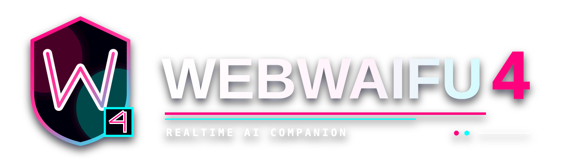

<div align="center">




### _A local-first VTuber AI companion for the browser, desktop, Twitch, and Discord collaboration voice._

WebWaifu4 combines streamed LLM chat, realtime speech, a VRM avatar, emotion-driven
animation, Twitch intake, Discord voice collaboration, persistent memory, tools,
captions, and local backup restore. The rebuild keeps the original WebWaifu4 look
and tab workflow while separating the backend services that need stricter provider
compatibility and runtime testing.

### Watch WebWaifu4

https://github.com/user-attachments/assets/3579153a-26cf-45ba-b0b4-2de99c45b9fd

<br/>


<br/>

<a href="#what-this-is">What This Is</a>
-
<a href="#feature-map">Feature Map</a>
-
<a href="#ai-runtime">AI Runtime</a>
-
<a href="#realtime-voice-and-tts">Voice and TTS</a>
-
<a href="#grillo-memory">Memory</a>
-
<a href="#quick-start">Quick Start</a>
-
<a href="#release-status">Status</a>

</div>

---

<h2 align="center" id="what-this-is">What This Is</h2>

<p align="center">
  <strong>A live AI co-host and companion with a VRM body, streamed voice,
  participant-aware chat, and inspectable long-term memory.</strong>
</p>

<p align="center">
  The browser is the primary control surface. The Windows Electron build runs the
  same app with an owned local backend, transparent avatar window, and OBS-friendly
  overlay. External providers are used only for the selected chat, speech,
  transcription, search, or embedding lane.
</p>

The settings menu contains the following real surfaces:

`Account` | `Avatar` | `Background` | `Animation` | `Emotion Log` | `Character` |
`Voice Lab` | `AI` | `Twitch` | `Discord` | `Memory` | `TTS`

Provider keys live in the browser Account tab and are sent with the request to the
app backend. Environment variables are optional fallback values. There is no
WebWaifu account or required cloud sync service.

---

<h2 align="center" id="feature-map">Feature Map</h2>

| Surface | Implemented feature set |
| --- | --- |
| **Account** | Browser IndexedDB key vault for OpenAI utility, OpenRouter, Vercel AI Gateway, Fish Audio, Inworld, and Tavily; complete local transfer backup import/export. |
| **AI** | OpenRouter Responses and Vercel AI Gateway, model catalog discovery, capability tags, provider routing, structured/text reply lanes, HTTP streaming, POML prompts, runtime situation injection, prompt-cache telemetry, and optional Tavily tools. |
| **TTS** | Fish realtime WebSocket, Fish Timestamp SSE, Inworld HTTP/WebSocket, browser-local Piper, early speech chunking, audible benchmarks, browser/Electron playback, optional output mirroring, captions, and wLipSync. |
| **Voice Lab** | Fish and Inworld catalogs, persona voice binding, Fish Voice Design, Fish zero-shot voice creation, Inworld Voice Design/publishing, Inworld cloning, sample audition, and backup/restore. |
| **Avatar** | Bundled/uploaded/saved VRMs, camera and stage controls, gaze, spring bones, MToon/PBR tuning, lighting, outlines, color correction, blink, and framing. |
| **Animation** | VRMA/BVH/FBX catalog, categorized idle/listening/talking/reaction/event clips, non-repeating shuffle, crossfades, imported animation review, and emotion-triggered playback. |
| **Emotion Log** | Model emotion, requested face, VAD affect, resolved expression, reaction animation, applied/skipped state, peak weight, and live mouth telemetry. |
| **Twitch** | Anonymous browser IRC without a Twitch API key, direct/all-chat queues, stream commands, adaptive batching, stream-audio transcription, and vision-frame context. |
| **Discord** | Optional collaboration voice bridge with DAVE receive, Opus decode, energy VAD, overlapping-speaker handling, Fish/OpenRouter/Vercel transcription, interruptions, readable replies, and optional TTS mirroring. |
| **Memory** | LadybugDB/JSON fallback, GRILLO background worker, semantic recall, evidence ledger, temporal claims, relationship state, diary, graph projections, provenance diagnostics, repair queue, migration tools, and detailed inspection UI. |

---

<h2 align="center" id="ai-runtime">AI Runtime</h2>

### Provider and model compatibility

WebWaifu4 uses model metadata as runtime safety data, not decoration. The model
picker displays capability tags for structured JSON, vision, files, video,
reasoning, tools, implicit caching, model type, and context window. Image, video,
embedding, OpenAI o1, and OpenAI pro entries are filtered out of the normal chat
picker where they do not belong.

- **OpenRouter Responses:** Auto, Fastest latency, Highest throughput/Nitro, or
  pinned provider slug lists. Pinned routing can allow or reject provider fallback.
- **Vercel AI Gateway:** Verified auto, fastest first token, highest throughput,
  lowest cost, or pinned provider order with optional fallback.
- **Provider-specific shaping:** OpenRouter and Vercel use separate provider
  options. Compatibility work in one lane does not silently change the other.
- **Structured reply gating:** OpenRouter uses structured output only when the
  model metadata advertises it. Unsupported models use streamed text plus a
  `<yw-meta>` metadata block. Vercel uses catalog metadata when present and its
  provider-compatible structured lane otherwise.
- **Reasoning defaults:** OpenRouter reasoning effort is disabled for chat.
  DeepSeek thinking is disabled on Vercel, and other Vercel reasoning models use
  minimal effort by default so visible replies are not starved by hidden work.
- **Defensive provider routing:** Structured or tool requests require compatible
  provider parameters. Verified DeepSeek V4 Flash/Pro provider orders are applied
  by the Vercel lane unless the user chooses an explicit routing mode.

### Conversation and prompt pipeline

- Replies stream over HTTP as visible deltas. Metadata is parsed separately and
  is never intentionally read aloud.
- Conversation context is app-owned and stateless at the provider boundary. Each
  local, Twitch, and Discord conversation has its own scoped state and a rolling
  maximum of 36 normalized chat messages.
- A **Runtime Situation** field can inject temporary scene context such as "we are
  privately testing" or "we are live on stream" without turning it into durable
  persona text.
- POML renders the dynamic system prompt. The current animation catalog is not
  dumped into the LLM context; the model emits emotion metadata and the app maps
  that metadata to expressions and reactions downstream.
- Reply length, temperature, maximum output, tool mode (`Off`, `Auto`, or
  `Required`), and maximum tool rounds are adjustable.
- Tavily search/extract/crawl tools are available to main chat and remain separate
  from GRILLO's memory tools.
- Prompt cache and cached-token telemetry are visible where the provider reports
  them.

---

<h2 align="center" id="realtime-voice-and-tts">Realtime Voice and TTS</h2>

Speech starts from the earliest acceptable streamed text chunk. Audio is decoded
and scheduled in the browser/Electron Web Audio pipeline, which is also the source
of truth for captions, mouth motion, and stream capture.

### Engines and transports

| Engine | Modes and controls |
| --- | --- |
| **Fish Audio** | Realtime WebSocket or Timestamp SSE over HTTP; `s2.1-pro-free`, `s2-pro`, and `s1`; personal/public/all voice catalogs or manual reference ID; PCM, MP3, WAV, or Opus; 16 kHz through 48 kHz sample rates; balanced/fastest latency; previous-chunk conditioning; fast phrase, safe phrase, or eager raw live chunking; 100-300 character chunk length. |
| **Inworld** | HTTP streaming or WebSocket; catalog or manual voice ID; adjustable 8-96 kHz sample rate; model ID; Stable, Balanced, Creative, or Expressive delivery; word, character, or no timestamps; synchronous/asynchronous timestamp strategy; 20-300 character buffer threshold; 0-10,000 ms buffer delay; auto mode. |
| **Piper Web** | Browser-local synthesis with a voice catalog and cached/loadable ONNX voice models. The UI reports the selected and active local voice. |

Remote pacing modes are exposed rather than hidden:

- **Fish live bridge:** one Fish realtime stream receives speakable LLM deltas.
- **Stable Stream:** prioritizes continuity and natural phrase boundaries.
- **Early Chunks:** lowers perceived latency by starting on an early safe phrase.
- **Sentence Chunks:** waits for complete sentence boundaries.

### Playback and output routing

- Enable/disable speech and auto-speak assistant replies independently.
- Test the selected voice, speak the last reply, or stop current audio.
- Browser playback rate is adjustable from 0.7x to 1.35x and gain from 0x to 2x.
- Browser/Electron playback always remains active because it drives the avatar and
  is the audio source a local stream captures.
- Optional outputs are additive: mirror to Discord for a remote collaborator or
  mirror to a selected external device. These side outputs are best-effort and do
  not block the primary browser audio path.
- Discord TTS is intended for collaboration. Voice input can still come from
  Discord while the reply plays only through the local browser/Electron app.

### Timing, captions, and mouth motion

- Fish Timestamp SSE and Inworld timestamp modes carry provider word timing when
  available. The shared speech-timing pipeline derives phonemes/visemes where the
  provider does not supply the final mouth representation.
- NDJSON speech events carry audio, timing, and stream status through one playback
  path. Captions use provider timing when possible and estimated timing as a
  fallback.
- **wLipSync Hybrid** blends analyser energy with A/I/U/E/O mouth weights.
- **wLipSync Direct** uses the raw A/I/U/E/O output.
- Smoothing, mouth gain, and volume influence are adjustable. Mouth updates are
  gated by the Web Audio clock so queued speech does not animate early.

### Audible benchmark

The built-in benchmark is not a synthetic request timer. It plays each result and
reports first-audio latency, total network time, playback time, chunk count, bytes,
word/phoneme counts, and errors. Benchmark text and rounds (1-10) are adjustable,
and the complete Markdown/JSON result can be copied for comparison.

---

<h2 align="center" id="voice-lab">Voice Lab</h2>

Voice Lab is a provider-aware voice workspace, not only a voice ID textbox.

### Fish Audio

- Browse Fish voice catalogs and load an existing entry into the voice draft.
- **Voice Design** calls Fish `voice-design-1` with a natural-language voice
  description, optional preview sentence/language, and 1-4 candidates. Each
  candidate can be auditioned before selection.
- The backend request surface also validates design speed, generation steps,
  guidance scales, and seed. The current UI intentionally exposes the core prompt,
  preview text, language, and candidate count rather than every advanced field.
- A selected designed candidate can become the reference sample for a reusable
  private Fish voice.
- Zero-shot/custom voice creation accepts an audio sample up to 20 MB plus an
  optional transcript, language, description, and tags. Fast training and quality
  enhancement are supported by the backend request surface.

### Inworld

- Browse the Inworld voice catalog or load an existing provider voice into a
  reusable draft.
- **Voice Design** accepts a 30-250 character design prompt, required preview text,
  and 1-3 previews. A selected preview can be published as an Inworld voice.
- Custom voice cloning accepts a sample up to 20 MB with language, transcript,
  description, tags, and optional background-noise removal.

Saved Voice Lab entries include provider/model IDs, notes, language/accent/style
details, emotional tone, stability, and expressiveness. Voices can be attached to
personas, made the persona default, auditioned, and included in local backup/restore.
If a persona has no remote binding, it can fall back to its bundled Piper preset.

---

<h2 align="center" id="avatar-animation-and-emotion">Avatar, Animation, and Emotion</h2>

### VRM stage

- Load bundled avatars, upload a VRM, or reuse a locally saved avatar. Bundled
  options include Riko variants, Hikari/Cool Hikky, Neuro-sama, and Neuro Clown.
- Full-body and half-body framing, model position/scale/rotation, locked or custom
  camera rigs, camera target/offset/FOV, pointer gaze, and audience gaze.
- VRM spring bones update with the render loop. Auto blink, expression weight,
  animation crossfade, and arm/torso clipping guards are adjustable.
- Backgrounds support persona auto-selection, image/URL, chroma key, and transparent
  output, with overlay/filter and transparency-test controls for OBS workflows.

### Material and scene tuning

- Shading presets retune the model's existing materials rather than replacing the
  VRM material system.
- Anime outline color, thickness, alpha, and scene exposure.
- Optional PBR roughness, metalness, specular, clearcoat, clearcoat roughness, and
  environment light controls.
- Optional MToon shade color/shift, toony response, GI equalization, rim color,
  rim lift/power, and light mix.
- RGB color correction plus key, fill, rim, hemisphere, and ambient lighting.

### Animation system

- Built-in and imported VRMA, BVH, and FBX animation playback.
- Catalog groups for base idle, listening, talking, emotion reactions, events,
  gestures, movement/pose, and clips awaiting review.
- Purpose, tags, loop eligibility, and experimental/review state are editable.
- Safe ambient idle/talking clips use a non-repeating random-bag shuffle. Weighted
  animation selection is not used.
- Emotion clips trigger from model emotion metadata, then crossfade back into the
  ambient sequence. The LLM does not need to know raw animation filenames.

### Emotion telemetry

The Emotion Log retains the latest 20 events and summarizes model emotion,
requested face, valence/arousal/dominance affect, final resolved expressions,
requested and peak weight, reaction animation, applied/pending/skipped status, and
live A/I/U/E/O mouth weights. This is both a debugging surface and a way to verify
that structured reply metadata reached the avatar.

---

<h2 align="center" id="live-surfaces">Twitch and Discord</h2>

### Twitch

- Anonymous, read-only Twitch IRC runs in the browser and does not require a
  Twitch API key.
- Switch channels, show overlay chat, keep a trusted local controller, and choose
  direct-message or all-chat batching behavior.
- Stream mode includes AI reply toggles, command handling, mention thresholds,
  adaptive batching based on active chatters, queue limits, and cooldown controls.
- Stream-audio ASR can use Fish or an OpenRouter transcription model. Sampling
  length, interval, and transcript snippets are configurable. The backend requires
  FFmpeg plus yt-dlp or streamlink for this lane.
- Stream vision captures JPEG frames at adjustable detail/interval/age and only
  attaches them when the selected chat model supports image input.
- Stream transcripts are ambient context, not fake user chat messages.

### Discord collaboration voice

Discord is an optional voice surface for collaboration, not a replacement chat
runtime or a required dependency.

- Bot token, guild, and voice channel are configured from the Discord tab.
- `@discordjs/voice` receives DAVE-encrypted voice; Opus is decoded locally.
- Deterministic energy VAD separates speech, and per-speaker queues preserve each
  speaker while allowing different speakers to overlap.
- Fish, OpenRouter, or Vercel can transcribe the captured utterance. The model and
  language hint are selectable.
- VAD threshold, end silence, minimum speech, and maximum utterance length are
  adjustable.
- Interruption policy can ignore speech, stop the current reply, or barge in.
  Trusted controller IDs can restrict who controls the character.
- Reply text can be posted into Discord. TTS mirroring is optional and intended
  for remote collaborators; local browser/Electron audio and lip sync remain live.

Discord voice and all ASR lanes are off until explicitly configured and enabled.

---

<h2 align="center" id="grillo-memory">GRILLO Memory</h2>

GRILLO is an optional background memory worker backed by LadybugDB, with a pinned
JSON fallback when the native backend is unavailable. It is deliberately isolated:
a memory failure must not break chat streaming, TTS, mouth motion, animation, or
provider routing.

### Working memory model

- Scoped local, Twitch, and Discord turns preserve source and participant identity.
- Context packets have separate lanes for background information, channel history,
  relationship memory, recalled memories, thoughts, and output instructions.
- Native semantic recall embeds the current query and filters vectors by exact
  embedding model/provider/version generation. Known incompatible generations are
  never mixed.
- Browser-local Transformers embeddings are supported, with provider embedding
  catalogs and fallback when selected.
- Per-lane and global budgets produce deterministic inclusion/drop/duplicate
  receipts through explicit diagnostic surfaces.

### Background worker

The worker can run automatically by message cadence or manually from the Memory
tab. Available beats are:

`extraction` | `relationship` | `reflection` | `consolidation` | `curiosity` |
`tag_elaboration` | `compaction` | `semantic_indexing`

Manual controls can run the complete worker, extraction only, an individual beat,
consolidation, compaction, or semantic indexing. The tab also shows the configured
worker provider/model, cadence, current-scope backlog, last embedding call, and
backend runtime state.

Its tools can read/search memory, list/write candidates, propose canonical claims,
write diary entries and memory blocks, patch relationship profiles, read/update
emotion, insert archival memory, and list/transition repair tasks. Worker model
output uses provider-compatible JSON object mode followed by local Zod validation.

Stored and inspectable records include turn events, candidate memories, memory
blocks, slots, slot patches, diary entries, relationship profiles/facts, emotion
state, semantic records, vectors, activity logs, and worker context traces.

### Evidence ledger and temporal claims

- Raw turn, observation, feedback, correction, and external evidence records are
  append-only.
- Canonical claims can represent facts, preferences, opinions, relationships,
  decisions, goals, boundaries, threads, and bond signals.
- Claim operations are `ADD`, `UPDATE`, `SUPERSEDE`, `NOOP`, `REJECT`, and `DEFER`.
- Writes enforce evidence, scope, participant identity, temporal validity, exact
  supersession targets, duplicate no-ops, and conflict handling.
- The deterministic ledger projector rebuilds beliefs, relationship claims, slots,
  and a provenance timeline with a stable SHA-256 generation.
- Feedback/correction endpoints append immutable evidence and enqueue scoped repair
  work. The repair queue replays open, deferred, and resolved state.

### Inspection and migration

The Memory tab exposes backend counts, graph scopes/participants/personas/edges,
turns, candidates, slots/patches, diary, worker activity/traces, relationships,
blocks, emotion, semantic/vector records, prompt context, and reset controls.

The backend also exposes read-only ledger projections, coverage audits, prompt
shadow comparison, deterministic evidence migration planning, append-only migration
application/receipts, context provenance, and memory-sufficiency diagnostics.

### Current boundaries

These boundaries are intentional and important:

- The live prompt still uses the established blocks, slots, relationships, diary,
  and semantic projections. The canonical ledger is inspectable but has not replaced
  the live prompt source.
- Migration backfills deterministic turn evidence only. It does not invent claims.
- Memory-sufficiency diagnostics are opt-in, do not run during normal chat preflight,
  do not trigger a second retrieval, and do not write repair events.
- Repair tasks from manual feedback/corrections work; automatic diagnosis for weak
  grounding, missing lanes, dropped evidence, and unresolved questions is pending.
- Extraction and semantic-index watermarks are per scope. A real cross-process
  atomic worker lease is not implemented, so multi-instance GRILLO workers should
  not be treated as coordinated.
- Switching the live prompt to ledger projections requires a separate, reversible,
  per-scope migration decision.

---

<h2 align="center" id="local-data-and-backups">Local Data and Backups</h2>

The local transfer backup includes settings, browser provider keys, personas,
scoped chat histories, relationship/memory state, saved custom VRMs, and Voice Lab
entries. Large import/export work runs through workers so restoring a backup does
not block the VRM render loop. The format is intended for moving one complete local
setup between the browser and desktop app.

Ladybug memory data is stored under `.webwaifu4` by the backend. Full scoped deletion
removes only the requested scope across native and JSON-fallback record sets.

---

<h2 align="center" id="quick-start">Quick Start</h2>

Requires Node.js 22 or newer.

```powershell
git clone https://github.com/xsploit/Waifu4.git
cd Waifu4
npm install
npm run dev
```

Open `http://localhost:5173/`.

Common verification:

```powershell
npm test -- --run
npm run typecheck
npm run build
npm run smoke:runtime
```

Full release gate:

```powershell
npm run audit:release
```

The release audit scans tracked source and built output for local backups,
databases, environment files, key-shaped literals, build artifacts, and legacy
reference folders, then runs dead-code audit, typecheck, the full test suite,
production build, distribution audit, and runtime smoke.

---

<h2 align="center" id="desktop-release">Desktop Release</h2>

The Windows Electron release packages the same frontend with an owned local backend
and bundled Node runtime. It includes the full editor, a transparent desktop avatar
window, and an OBS-friendly overlay window while preserving the Account-tab key
flow.

```powershell
npm run desktop:dist
npm run smoke:packaged-ui
npm run smoke:packaged-ui:desktop
npm run smoke:desktop-port-fallback
npm run smoke:desktop-owned-backend-reuse
npm run smoke:desktop-relaunch
```

The build produces an NSIS installer and portable executable. The desktop backend
can reuse a matching WebWaifu-owned process and selects another local port when the
default is occupied.

If an indexed or synchronized `Documents` folder causes an electron-builder
`EPERM` rename failure, redirect output to an unsynchronized path:

```powershell
npm run build; npm run desktop:runtime
npx electron-builder --config.directories.output=C:/dev/ww4-release
```

---

<h2 align="center" id="vps-deploy">VPS Deploy</h2>

WebWaifu4 expects a normal long-running process for hosted operation:

```text
VPS
`-- Docker Compose
    |-- WebWaifu4 app container
    |-- Caddy reverse proxy
    `-- named volume for .webwaifu4 memory data
```

```bash
git clone https://github.com/xsploit/Waifu4.git /opt/waifu
cd /opt/waifu
WEBWAIFU_SITE_ADDRESS=waifu.example.com docker compose up -d --build
```

Caddy serves HTTPS and WebSocket upgrades while the Node backend serves the Vite
build and `/api/*`. Browser Account-tab keys remain the normal provider-key path;
Compose environment keys are optional fallbacks. The `webwaifu_data` volume
persists `.webwaifu4` memory data.

---

<h2 align="center" id="release-status">Release Status</h2>

The main browser and Windows desktop surfaces are implemented. Local release gates
cover source scanning, type safety, tests, production output, runtime startup, and
packaged desktop behavior. Provider-backed features still require their matching
credentials and live-provider verification; a passing unit test cannot guarantee
that an external catalog or model has not changed.

### Current backlog

- Add direct browser microphone voice chat. Discord voice intake exists; Twitch
  transcription remains stream-audio sampling.
- Add automatic GRILLO repair diagnosis and a real persistent cross-process lease.
- Keep the ledger-to-live-prompt switch gated until repeated participant-aware
  shadow reports prove parity and a rollback path exists.
- Add silence/gap detection to the audible TTS benchmark.
- Continue real-provider verification for Voice Lab, Tavily, Inworld, Fish,
  OpenRouter, Vercel routing, and transcription models.
- Continue Piper model packaging, external-device/Discord output checks, and
  Windows transparent-window/GPU release testing.

### Ground rules

- Preserve the original frontend shape and settings workflow.
- Keep browser Account-tab keys as the primary credential path.
- Keep chat and TTS latency paramount; optional memory and Discord side work must
  not block the live response/audio path.
- Let audible benchmarks and runtime traces settle TTS behavior instead of code
  shape alone.
- Do not publish local transfer backups, databases, or real provider keys.
